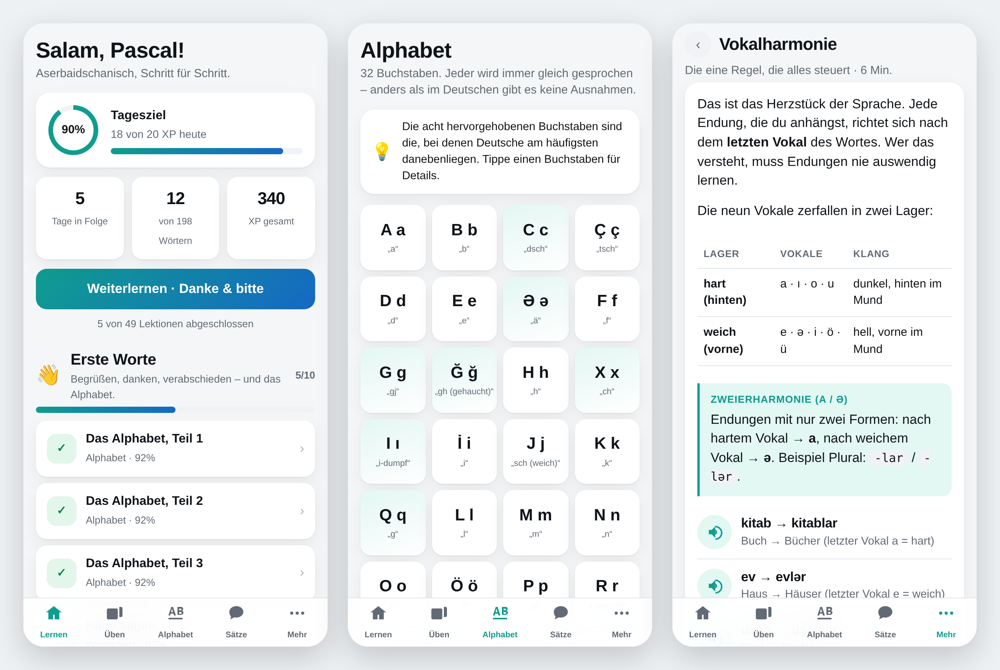

# Azərbaycanca — Aserbaidschanisch lernen

Eine Lern-App für die Grundkenntnisse des Aserbaidschanischen, gebaut für das iPhone.
Sie läuft als installierbare Web-App (PWA): Icon auf dem Home-Bildschirm, Vollbild,
offline nutzbar, kein App Store, kein Konto, keine Server.



---

## Auf dem iPhone installieren

Alles lässt sich direkt am Handy erledigen — aber **nicht in der GitHub-App**.
Die App kann keine Repository-Einstellungen. Öffne github.com stattdessen in **Safari**.

### Schritt 1 — Die App einschalten (einmalig)

1. In **Safari** `github.com/pascal199066-star/Sprach-App` öffnen und anmelden.
2. Oben auf **Settings** tippen (Zahnrad-Reiter; ganz rechts in der Reiterleiste,
   eventuell muss die Leiste seitlich gescrollt werden).
3. In der linken Liste nach unten zu **Pages** scrollen.
4. Unter **Build and deployment → Source** steht **Deploy from a branch**. So lassen.
5. Darunter bei **Branch** auf **None** tippen und
   `claude/azerbaijani-learning-app-ios-fjv65u` auswählen, Ordner auf **/ (root)** lassen.
6. **Save** tippen.

Nach ein bis zwei Minuten erscheint auf derselben Seite oben ein grüner Kasten mit
der Adresse der App — ungefähr so:

```
https://pascal199066-star.github.io/Sprach-App/
```

Diese Adresse ist die App. Lädt sie noch nicht: eine Minute warten und neu laden.

### Schritt 2 — Aufs Home-Bildschirm legen

1. Die Adresse in **Safari** öffnen.
2. Unten auf das **Teilen-Symbol** tippen (Quadrat mit Pfeil nach oben).
3. In der Liste nach unten wischen zu **„Zum Home-Bildschirm"** → **Hinzufügen**.

Jetzt liegt ein App-Icon auf dem Home-Bildschirm. Von dort gestartet läuft die App
im Vollbild ohne Safari-Leisten — und auch ohne Internet.

### Schritt 3 — Die Stimme laden (wichtig!)

iOS bringt keine aserbaidschanische Stimme mit. Türkisch und Aserbaidschanisch sind
lautlich aber nahezu deckungsgleich, deshalb nutzt die App die türkische Systemstimme:

**Einstellungen → Bedienungshilfen → Gesprochene Inhalte → Stimmen → Türkisch → Laden**

Danach die App einmal schließen und neu öffnen. Unter **Mehr → Einstellungen** lassen
sich Stimme und Sprechtempo anpassen.

> **Hinweis:** Die Seite ist öffentlich erreichbar, sobald sie eingeschaltet ist —
> so funktioniert GitHub Pages. Es stehen keine persönlichen Daten darin, der
> Lernstand bleibt allein auf deinem iPhone.

> **Später:** Wird der Branch irgendwann nach `main` zusammengeführt, unter
> **Pages → Branch** einfach auf `main` umstellen. Die Adresse bleibt gleich.

## Was die App kann

| Bereich | Inhalt |
|---|---|
| **Kurs** | 6 Einheiten, 49 Lektionen — vom Alphabet bis zum Smalltalk |
| **Alphabet** | Alle 32 Buchstaben mit Lautschrift, Beispielwort und Hinweisen für Deutsche |
| **Wortschatz** | 198 Wörter und Wendungen in 11 Themengebieten, alle vertont |
| **Grammatik** | 11 kompakte Kapitel: Vokalharmonie, Fälle, Zeiten, Satzbau, Höflichkeit |
| **Dialoge** | 4 Alltagsszenen, zeilenweise oder am Stück anhörbar |
| **Aussprache** | Wort anhören, selbst aufnehmen, direkt vergleichen |
| **Wiederholen** | Karteikasten mit verteiltem Lernen (SM-2), meldet fällige Wörter |
| **Fortschritt** | Streak, Tagesziel, XP, Statistik nach Themen |

### Übungstypen

Aus dem Wortschatz baut die App automatisch sechs Übungsformen:
Wort einführen · Bedeutung wählen · Übersetzung wählen · Hörverstehen ·
Satz aus Bausteinen zusammensetzen · frei tippen (mit Sonderzeichen-Tastenreihe für `ə ı ö ü ç ş ğ q x`).

Falsch beantwortete Aufgaben kommen am Ende der Lektion noch einmal.

---

## Wie die Aussprache funktioniert

Die App spricht mit der türkischen Systemstimme, passt den Text vorher aber an
den aserbaidschanischen Lautbestand an:

| Aserbaidschanisch | wird gesprochen als | Laut |
|---|---|---|
| `ə` | `e` | offenes ä wie in „Bär“ |
| `q` | `g` | wie deutsches g |
| `x` | `h` | ch wie in „Bach“ (nächste Annäherung) |

Beispiel: `Bağışlayın, qapı xoşdur` → `Bağışlayın, gapı hoşdur`

Findet die App eine echte `az`-Stimme (manche Android-Geräte, künftige iOS-Versionen),
nutzt sie diese automatisch und ohne Umschreibung. Zusätzlich steht unter jedem Wort
eine deutsche Lautschrift — bei `ə`, `q` und `x` ist sie genauer als die Stimme.

---

## Aufbau

```
index.html              App-Hülle
manifest.webmanifest    Name, Icons, Vollbild-Verhalten
sw.js                   Service Worker – macht alles offline verfügbar
css/app.css             Design, helles und dunkles Erscheinungsbild
js/
  app.js                Einstieg: Router, Tableiste, globale Audio-Knöpfe
  speech.js             Sprachausgabe inkl. Umschrift für die türkische Stimme
  store.js              Fortschritt & Einstellungen (localStorage)
  srs.js                Verteiltes Wiederholen (SM-2, vereinfacht)
  lesson-engine.js      Erzeugt die Übungen aus den Kursdaten
  views/                Die einzelnen Ansichten
data/
  alphabet.js           32 Buchstaben
  vocab.js              198 Wörter und Wendungen
  grammar.js            11 Grammatikkapitel
  course.js             Kursaufbau: Einheiten und Lektionen
  dialogues.js          4 Dialoge
```

Kein Build-Schritt, keine Abhängigkeiten — reines ES-Modul-JavaScript.

### Inhalte erweitern

Neues Wort in `data/vocab.js` eintragen (die `id` nie nachträglich ändern, daran hängt
der Lernfortschritt) und die `id` in `data/course.js` einer Lektion zuordnen.
Die Übungen entstehen daraus von selbst.

### Lokal ausprobieren

```bash
python3 -m http.server 8777
# dann http://localhost:8777 öffnen
```

---

## Datenschutz

Lernstand, Einstellungen und Aufnahmen bleiben auf dem Gerät. Es gibt keine Anmeldung,
keine Analyse, keine Netzwerkanfragen außer dem Laden der App selbst. Aufnahmen aus dem
Aussprache-Trainer liegen nur im Arbeitsspeicher und werden beim Wortwechsel verworfen.

Der Lernstand hängt an den Website-Daten von Safari: Werden diese gelöscht,
ist auch der Fortschritt weg.
