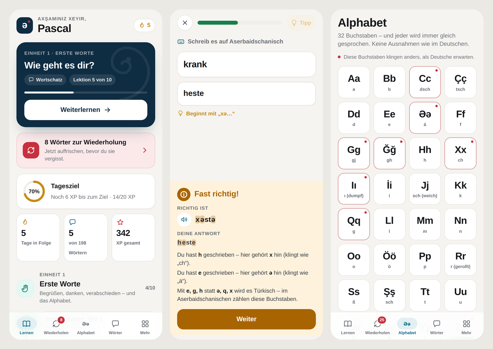

# Sprach-App — Aserbaidschanisch & Business English

Eine Lern-App mit zwei umschaltbaren Kursen, gebaut für das iPhone:

- **Azərbaycanca** – Aserbaidschanisch von Grund auf
- **Business English** – für Fortgeschrittene (B2 → C1), mit Fokus auf flüssiges Sprechen

Umschalten oben auf der Startseite oder unter **Mehr → Einstellungen → Sprache**.
Jeder Kurs hat seinen eigenen Lernstand; Streak und Tagesziel zählen gemeinsam.
Sie läuft als installierbare Web-App (PWA): Icon auf dem Home-Bildschirm, Vollbild,
offline nutzbar, kein App Store, kein Konto, keine Server.



---

## Auf dem iPhone installieren

Alles lässt sich direkt am Handy erledigen — aber **nicht in der GitHub-App**.
Die App kann keine Repository-Einstellungen. Öffne github.com stattdessen in **Safari**.

### Schritt 1 — Die App einschalten (einmalig)

1. In **Safari** `github.com/pascal199066-star/Sprach-App` öffnen und anmelden.
2. Oben auf **Settings** tippen (Zahnrad-Reiter; ganz rechts in der Reiterleiste,
   eventuell muss die Leiste seitlich gescrollt werden).
3. In der linken Liste nach unten zu **Pages** scrollen.
4. Unter **Build and deployment → Source** steht **Deploy from a branch**. So lassen.
5. Darunter bei **Branch** auf **None** tippen und
   `claude/happy-tesla-slf8t4` auswählen (die überarbeitete Version), Ordner auf **/ (root)** lassen.
6. **Save** tippen.

Nach ein bis zwei Minuten erscheint auf derselben Seite oben ein grüner Kasten mit
der Adresse der App — ungefähr so:

```
https://pascal199066-star.github.io/Sprach-App/
```

Diese Adresse ist die App. Lädt sie noch nicht: eine Minute warten und neu laden.

### Schritt 2 — Aufs Home-Bildschirm legen

1. Die Adresse in **Safari** öffnen.
2. Unten auf das **Teilen-Symbol** tippen (Quadrat mit Pfeil nach oben).
3. In der Liste nach unten wischen zu **„Zum Home-Bildschirm"** → **Hinzufügen**.

Jetzt liegt ein App-Icon auf dem Home-Bildschirm. Von dort gestartet läuft die App
im Vollbild ohne Safari-Leisten — und auch ohne Internet.

### Schritt 3 — Nur falls nötig: Ersatzstimme laden

Die App bringt echte aserbaidschanische Aufnahmen mit (siehe unten). Nur für Sätze
ohne Aufnahme springt die Stimme des iPhones ein – dafür einmalig laden:

**Einstellungen → Bedienungshilfen → Gesprochene Inhalte → Stimmen → Türkisch → Laden**

Unter **Mehr → Einstellungen** lassen sich Stimme (Banu oder Babək) und Sprechtempo
anpassen und alle Aufnahmen für den Offline-Betrieb speichern.

> **Hinweis:** Die Seite ist öffentlich erreichbar, sobald sie eingeschaltet ist —
> so funktioniert GitHub Pages. Es stehen keine persönlichen Daten darin, der
> Lernstand bleibt allein auf deinem iPhone.

> **Später:** Wird der Branch irgendwann nach `main` zusammengeführt, unter
> **Pages → Branch** einfach auf `main` umstellen. Die Adresse bleibt gleich.

## Business English (B2 → C1)

| Bereich | Inhalt |
|---|---|
| **Kurs** | 6 Einheiten, 48 Lektionen: Meetings & Calls, Diplomatie, E-Mails, Präsentieren, Verhandeln, Networking |
| **Wortschatz** | 170 Business-Ausdrücke in 12 Themen – jeder mit Beispielsatz, Stolperfallen erklärt |
| **Grammatik & Stil** | 7 Kapitel zu typischen Fehlern Deutschsprachiger, diplomatischem Ton, E-Mail-Register, Signposting, Konditionalsätzen, falschen Freunden |
| **Dialoge** | 6 Business-Situationen mit britischer und amerikanischer Stimme |
| **Sprechen** | *Satz-Sprint*: deutscher Satz → in wenigen Sekunden laut auf Englisch. *Freies Sprechen*: 12 Situationen, eine Minute reden, aufnehmen, mit Musterantwort vergleichen |

Zusätzliche Übungsform: **Lückensätze** – der passende Ausdruck muss in einen echten Business-Satz.

## Aserbaidschanisch – was die App kann

| Bereich | Inhalt |
|---|---|
| **Kurs** | 6 Einheiten, 51 Lektionen – vom Alphabet bis zum Smalltalk |
| **Alphabet** | Alle 32 Buchstaben mit Lautschrift, Merkregel und je mehreren Hörbeispielen |
| **Wortschatz** | 198 Wörter und Wendungen in 11 Themen, Sätze mit Zerlegung in ihre Bausteine |
| **Grammatik** | 11 kompakte Kapitel: Vokalharmonie, Fälle, Zeiten, Satzbau, Höflichkeit |
| **Dialoge** | 6 Alltagsszenen mit verteilten Stimmen, Hörverstehen-Modus |
| **Aussprache** | Echte Aufnahmen, Trainer mit eigener Aufnahme, Aussprache-Hilfe mit Lautschrift-Legende |
| **Wiederholen** | Karteikasten mit verteiltem Lernen (SM-2), meldet fällige Wörter |
| **Fortschritt** | Streak, Tagesziel, XP, Statistik nach Themen |

### Übungstypen und Hilfen

Aus dem Wortschatz baut die App automatisch sechs Übungsformen:
Wort einführen · Bedeutung wählen · Übersetzung wählen · Hörverstehen ·
Satz aus Bausteinen zusammensetzen · frei tippen (mit Tastenreihe für `ə ı ö ü ç ş ğ q x`).

- **Tipp-Knopf** in jeder Übung: 50:50, nächster Buchstabe oder nächster Baustein.
  Mit Tipp gibt es weniger XP, und das Wort kommt früher wieder.
- **Erklärte Fehler:** Die falsche Stelle wird markiert. Bei verwechselten Buchstaben
  (`e`/`ə`, `g`/`q`, `h`/`x`, `i`/`ı` …) nennt die App die Ausspracheregel.
  Türkische Schreibweisen gelten nie als richtig.
- **Was hast du gewählt?** Bei einer falschen Auswahl zeigt die App, was die gewählte
  Antwort bedeutet.
- **Bausteine:** Sätze werden in Wortteile zerlegt, z. B. *Almaniya · -dan · -am* =
  Deutschland · aus · ich bin.
- **Aussprache-Tipps** direkt am Wort für die Stolperlaute.

Falsch beantwortete Aufgaben kommen am Ende der Lektion noch einmal. Die
Zusammenfassung listet die Wörter, die du dir noch einmal ansehen solltest.

---

## Wie die Aussprache funktioniert

iOS bringt keine aserbaidschanische Stimme mit, und die türkische Stimme klingt
hörbar türkisch: Sie kennt kein `ə`, kein `x`, verschluckt das `ğ` und betont anders.
Deshalb liefert die App **fertige Aufnahmen** mit, erzeugt mit den neuronalen
aserbaidschanischen Stimmen von Microsoft (`az-AZ-BanuNeural`, `az-AZ-BabekNeural`).
Für Business English gibt es genauso Aufnahmen: britisch (`en-GB-SoniaNeural`) und
amerikanisch (`en-US-AndrewNeural`).
Die Aufnahmen liegen als MP3 in `audio/`, funktionieren offline und lassen sich
langsamer abspielen.

```bash
pip install edge-tts
node tools/collect-audio.mjs     # sammelt alle Texte aus data/
python3 tools/make_audio.py      # erzeugt fehlende Aufnahmen + audio/manifest.json
```

Das übernimmt auch der GitHub-Workflow **„Aufnahmen erzeugen“** (`.github/workflows/audio.yml`):
Er läuft automatisch, sobald sich etwas in `data/` ändert, und checkt die neuen
Aufnahmen selbst ein. Von Hand starten: **Actions → Aufnahmen erzeugen → Run workflow**.

Der Dateiname ist ein Hash des Textes. Nach neuen oder geänderten Wörtern einfach
beide Befehle erneut ausführen, vorhandene Aufnahmen werden übersprungen.

Fehlt für einen Satz eine Aufnahme, spricht die Systemstimme als Notlösung
(aserbaidschanisch, falls vorhanden, sonst türkisch mit angenähertem Text). Unter
jedem Wort steht zusätzlich eine deutsche Lautschrift. Wie man sie liest, erklärt
**Mehr → Aussprache-Hilfe**.

---

## Aufbau

```
index.html              App-Hülle
manifest.webmanifest    Name, Icons, Vollbild-Verhalten
sw.js                   Service Worker – macht alles offline verfügbar
css/app.css             Design, helles und dunkles Erscheinungsbild
js/
  app.js                Einstieg: Router, Tableiste, globale Audio-Knöpfe
  lang.js               welche Sprache gerade läuft, Umschalten
  speech.js             Aufnahmen abspielen, sonst Systemstimme
  recorder.js           eigene Aufnahme im Sprechtraining
  audio-key.js          Dateinamen der Aufnahmen (von App und Werkzeug geteilt)
  store.js              Fortschritt & Einstellungen (localStorage)
  srs.js                Verteiltes Wiederholen (SM-2, vereinfacht)
  lesson-engine.js      Erzeugt die Übungen aus den Kursdaten
  components.js         Symbole und wiederverwendbare Bausteine
  views/                Die einzelnen Ansichten
data/
  active.js             das aktive Sprachpaket – alle Ansichten lesen von hier
  en/                   Business English: vocab, course, grammar, dialogues, speaking
  alphabet.js           32 Buchstaben mit Hörbeispielen
  vocab.js              198 Wörter und Wendungen mit Bausteinen
  grammar.js            11 Grammatikkapitel
  course.js             Kursaufbau: Einheiten und Lektionen
  dialogues.js          6 Dialoge
audio/                  Aufnahmen (f/m = Aserbaidschanisch, en-f/en-m = Englisch) + manifest.json
tools/                  Werkzeuge zum Erzeugen der Aufnahmen
```

Kein Build-Schritt, keine Abhängigkeiten — reines ES-Modul-JavaScript.

### Inhalte erweitern

Neues Wort in `data/vocab.js` (Englisch: `data/en/vocab.js`) eintragen – die `id` nie
nachträglich ändern, daran hängt der Lernfortschritt – und die `id` in `data/course.js`
(bzw. `data/en/course.js`) einer Lektion zuordnen.
Die Übungen entstehen daraus von selbst. Danach die Aufnahmen neu erzeugen (siehe oben).

### Lokal ausprobieren

```bash
python3 -m http.server 8777
# dann http://localhost:8777 öffnen
```

---

## Datenschutz

Lernstand, Einstellungen und Aufnahmen bleiben auf dem Gerät. Es gibt keine Anmeldung,
keine Analyse, keine Netzwerkanfragen außer dem Laden der App selbst. Aufnahmen aus dem
Aussprache-Trainer liegen nur im Arbeitsspeicher und werden beim Wortwechsel verworfen.

Der Lernstand hängt an den Website-Daten von Safari: Werden diese gelöscht,
ist auch der Fortschritt weg.
